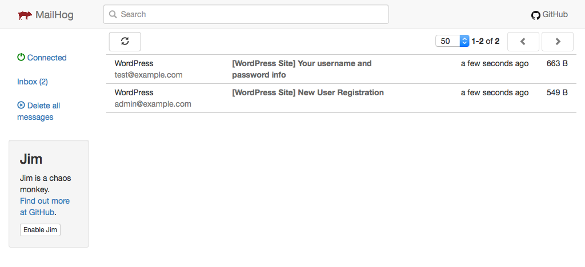

+++
title = "Sending Email"
description = "AdiDoks is a Zola theme helping you build modern documentation websites, which is a port of the Hugo theme Doks for Zola."
date = 2021-05-01T08:00:00+00:00
updated = 2021-05-01T08:00:00+00:00
draft = false
weight = 130
sort_by = "weight"
template = "docs/page.html"

[extra]
lead = 'AdiDoks is a Zola theme helping you build modern documentation websites, which is a port of the Hugo theme <a href="https://github.com/h-enk/doks">Doks</a> for Zola.'
toc = true
top = false
+++

## Sending Email

We can use the excellent library [Lettre](https://lettre.rs/) for sending emails. I recommend installing [Mailhog](https://github.com/mailhog/MailHog) into your `.devcontainer/docker-compose.yml` as an email catcher.

Simply add the following config.

```yaml
# MailHog is an email testing tool for developers.
smtp:
    image: mailhog/mailhog
```

Then update your `.devcontainer/.env` with some email configuration env vars.

```
SMTP_HOST: smtp
SMTP_PORT: 1025
SMTP_USERNAME: thisisnotused
SMTP_PASSWORD: thisisnotused
SMTP_TLS_OFF: 'true'
```

We then update our `app/src/config.rs`.

```rust
use std::env;

#[derive(Clone, Debug)]
pub struct Config {
    pub database_url: String,
    // Configure SMTP for email.
    pub smtp_config: Option<SmtpConfig>,
}

#[derive(Clone, Debug)]
pub struct SmtpConfig {
    // Configure SMTP for email.
    pub host: String,
    pub port: u16,
    pub tls_off: bool,
    pub username: String,
    pub password: String,
}

impl SmtpConfig {
    pub fn new() -> Option<SmtpConfig> {
        let host = env::var("SMTP_HOST");
        let username = env::var("SMTP_USERNAME");
        let password = env::var("SMTP_PASSWORD");
        let smtp_port = env::var("SMTP_PORT");

        if let (Ok(host), Ok(username), Ok(password), Ok(smtp_port)) =
            (host, username, password, smtp_port)
        {
            Some(SmtpConfig {
                host,
                port: smtp_port.parse::<u16>().unwrap(),
                tls_off: env::var("SMTP_TLS_OFF").is_ok(),
                username,
                password
            })
        } else {
            None
        }
    }
}

impl Config {
    // Initialise form oiur environment
    pub fn new() -> Config {
        let database_url = 
            env::var("DATABASE_URL")
            .expect("DATABASE_URL not set");

        Config {
            database_url,
            smtp_config: SmtpConfig::new(),
        }
    }
}
```

Create a helper function for email in `app/src/email.rs`.

```rust
use lettre::transport::smtp::authentication::Credentials;
use lettre::{Message, SmtpTransport, Transport};

pub fn send_email(config: &crate::config::Config, email: Message) {
    if let Some(smtp_config) = &config.smtp_config {
        let creds = Credentials::new(smtp_config.username.clone(), smtp_config.password.clone());

        let sender = if smtp_config.tls_off {
            SmtpTransport::builder_dangerous(smtp_config.host.clone())
                .port(smtp_config.port)
                .credentials(creds)
                .build()
        } else {
            SmtpTransport::relay(&smtp_config.host)
                .unwrap()
                .port(smtp_config.port)
                .credentials(creds)
                .build()
        };

        // Send the email
        match sender.send(&email) {
            Ok(_) => println!("Email sent successfully!"),
            Err(e) => panic!("Could not send email: {:?}", e),
        }
    }
}
```

We should now be able to form a message and call our helper function and see the results in Mailhog.

